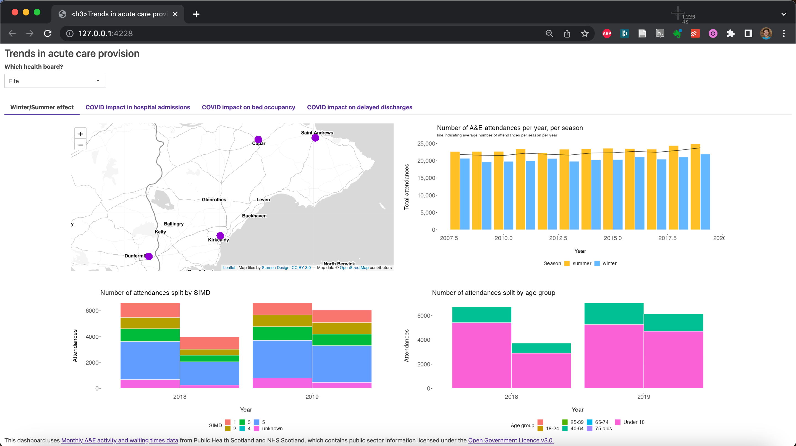
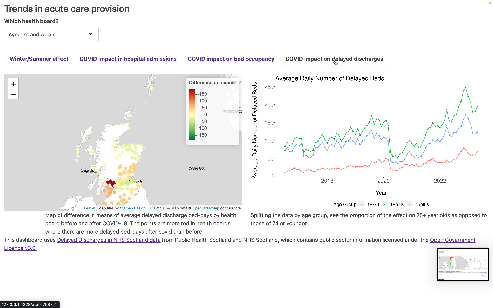

# PHS_penguin_team_project
 
## Project description

The project we are going to describe is a group project we were assigned during our CodeClan course. The group was composed by four people Thijmen Breeschoten, Chiara Capresi, Naomi Penfold and Alistair Trucco. 
In this project we were asked to provide an analysis  of how acute care provision changes by season (summer versus winter) and with the impact of the COVID-19 pandemic, using data from Public Health Scotland and NHS Scotland.
As we reported, in a more detailed way, in the documentation file, our main approach was that of starting with a deep analysis of the data avilable with a view to idntifying KPIs that in our opinion might be significant for the client.
Each of us worked separately to the cleaning and wrangling data operations necessary for producing visualisations and explanation for each one of the KPIs we selected during the setting stage, even if we planned regular update stages for sharing with the other group's members new goals, hypothesis and concerns.


**todo:** says it's a codeclan project, what the brief was.

**Disclaimer:** this project was not requested by and had no involvement from Public Health Scotland or NHS Scotland, and any results or insights are not intended to be used in real life.

From the data available, we were able to explore several key performance indicators (KPIs) of acute care provision, including client intake (A&E attendances and hospital admissions), measures of service workload within the service (wait times in A&E and for hospital treatment, length of stay, bed occupancy), and an outflow metric that affects service capacity and resources (delayed discharge).


_Key indicators of acute care provision included in the available datasets._

To understand the impact of COVID-19 pandemic, we focused on three key indicators that cover the flow of clients into, within and out of hospital care: hospital admissions, bed occupancy, and delayed discharge.

To investigate seasonality, we focussed on A&E attendances, because we found a seasonal pattern here (also in A&E wait times) whereas we did not find any seasonality in other indicators.


_Dashboard tab 1: Seasonality patterns in A&E attendances (lead: Thijmen Breeschoten)_


_Dashboard tab 2: Impact of COVID-19 pandemic on hospital admissions (lead: Chiara Capresi). This shows the dropdown selector to choose health board: all 4 tabs are interactive and respond to this input selection._


_Dashboard tab 3: Impact of COVID-19 pandemic on hospital occupancy (lead: Naomi Penfold). This shows the hover-over function on the leaflet map plots._


_Dashboard tab 4: Impact of COVID-19 pandemic on delayed discharges (lead: Alistair Trucco)._

## Contributors

Dashboard created during CodeClan - Professional Data Analysis course by:

* Thijmen Breeschoten - [GitHub](https://github.com/Thijmen18) and [LinkedIn](https://www.linkedin.com/in/thijmenbreeschoten/)
* Chiara Capresi - [GitHub](https://github.com/ChiaraCapresi) and [LinkedIn](https://www.linkedin.com/in/chiara-capresi/)
* Naomi Penfold - [GitHub](https://github.com/npscience) and [LinkedIn](https://www.linkedin.com/in/naomipenfold/)
* Alistair Trucco - [GitHub](https://github.com/the-deadly-c0w) and [LinkedIn](https://www.linkedin.com/in/a-trucco/)

## About the data
 
This project uses data from Public Health Scotland and NHS Scotland, which contains public sector information licensed under the [Open Government Licence v3.0](https://www.nationalarchives.gov.uk/doc/open-government-licence/version/3/).

The Shiny dashboard presents data from the following specific datasets: 

* Monthly A&E activity and waiting times: https://www.opendata.nhs.scot/dataset/monthly-accident-and-emergency-activity-and-waiting-times  
* COVID-19 Wider Impacts - Hospital Admissions: https://www.opendata.nhs.scot/dataset/covid-19-wider-impacts-hospital-admissions 
* [for occupancy] Beds Information in Scotland: https://www.opendata.nhs.scot/dataset/hospital-beds-information 
* Delayed Discharges in NHS Scotland: https://www.opendata.nhs.scot/dataset/delayed-discharges-in-nhsscotland
* NHS Scotland Hospital Locations:
https://www.opendata.nhs.scot/dataset/hospital-codes/resource/c698f450-eeed-41a0-88f7-c1e40a568acc

Exploration notebooks also include work using these additional datasets:

* Treatment wait times: https://www.opendata.nhs.scot/dataset/stage-of-treatment-waiting-times
* Inpatient and day cases activity (including length of stay):
  * Activity by Board of Treatment and Specialty: https://www.opendata.nhs.scot/dataset/inpatient-and-daycase-activity/resource/c3b4be64-5fb4-4a2f-af41-b0012f0a276a
  * Activity by Board of Treatment, Age and Sex: https://www.opendata.nhs.scot/dataset/inpatient-and-daycase-activity/resource/00c00ecc-b533-426e-a433-42d79bdea5d4
  * Activity by Board of Treatment and Deprivation: https://www.opendata.nhs.scot/dataset/inpatient-and-daycase-activity/resource/4fc640aa-bdd4-4fbe-805b-1da1c8ed6383

## Running the app locally

### Requirements

R packages used over all scripts:

* tidyverse_2.0.0
* ggplot2_3.4.2
* janitor_2.2.0
* lubridate_1.9.2
* bslib_0.4.2 
* plotly_4.10.2
* leaflet_2.1.2
* sf_1.0-13 
* shiny_1.7.4


### How to run the app locally

1. **Download raw data:** download .csv data from websites above 
2. **Prepare cleaned data:** run all 5 cleaning scripts (in any order) - these will write new csvs into data/cleaned_data folder within your project directory, which are required for running the dashboard.
3. **Run the R Shiny dashboard locally:** run one of global, ui, server scripts - the shiny dashboard should load in your web browser

Note we downloaded the raw data files on ~July 7-14 2023. Any updates to the open data webpages since this date may affect whether the cleaning scripts run as expected. (We have not included data validation steps... yet.)

## Other information

**TODO:** What's in the repo, what does it do (in brief), any other process points

__Individual contributions to the project__

For this group project everyone contributed equally to the following tasks/activities:

* General data exploration
* Presentation deck
* Dashboard R Shiny framework
* Collaborative discussions and planning
* Git repository management
* Project description outline
* Drawing final conclusions
* finalisation README documentation

Besides the joined tasks each individual had their own specific contributions:

_Thijmen Breeschoten:_

* Initial data wrangling/cleaning of the A&E hospital activity datasets.
* Plot visualisations for A&E attendance KPI measurements.
* Data analyses, including hypothesis testing for summer/winter comparison per health board.
* Selecting insights and drawing conclusions for impact of seasonal effects on 
A&E attendances across Scotland.

_Chiara Capresi:_

* Analysing and cleaning datasets regarding impact of Covid on hospital admissions. 
* Producing visualisations about hospital admissions’ trend over time, from the beginning of 
covid emergency up to now.

_Naomi Penfold:_

* Exploring data about inpatient stays, treatment wait time and A&E attendances
* Analysing and cleaning data, and producing visualisations, about hospital occupancy
* Initial R Shiny design and scripts: global, ui and server; drawing wireframes throughout project
* Coding consistent themes (for ggplot outputs and R Shiny dashboard)
* Writing documentation (github README)

_Alistair Trucco:_

* translating nhs location data to be useable in leaflet
* Analysis and visualisations for delayed discharge data
* t-test workflow

__Presentation of the project and dashboard__

* Presentation: [PDF](presentation/Project_presentation.pdf) of the slides used for a 20-minute presentation to Codeclan instructors and fellow students in July 2023 (recording available on [Youtube](https://www.youtube.com/watch?v=r6ZMxNVfhYE))

## Licensing

As indicated above this project uses data from Public Health Scotland and NHS Scotland, which contains public sector information licensed under the [Open Government Licence v3.0](https://www.nationalarchives.gov.uk/doc/open-government-licence/version/3/).

This project is licensed under the terms of the MIT license. Please find details in 
```LICENSE.md``` within this repo.
